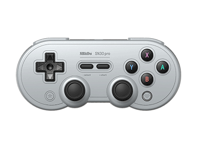

# SN30 Pro / SF30 Pro



## Firmware update instruction
* Download the firmware file
* Press and hold ```START```+```L1```+```R1``` buttons on the controller to put it on its update mode. LED on the top will blink in red.
* Connect the controller to your Windows via the USB-C cable.
* Click on “USB Upgrade” on your device, search for firmware.dat in the pop-up window and run it;
* Un-plug the gamepad when the upgrade process is done, then restart it before using. 

## Changelog
### v1.0.1 (2017-08-15)
- Hold START button POWER ON as SWITCH PRO mode.
- Hold START+A button POWER ON as MAC mode.
- Hold START+B button POWER ON as Android mode.
- Hold START+X button POWER ON as Xinput mode.

### v1.10 (2017-12-08)
- Fixed the crashing issue of the controller when Amiibo function is applied.
- Added sleep mode to the controller during its Bluetooth connection. 
- Changed the Turbo speed when used to 20FPS.
- Added vibration function to the controller when it is on X-input mode.
- Fixed the latency issue when it is used with Switch. 

### v1.20 (2017-12-12)
- Significant vibration optimization

### v1.21 (2017-12-13)
- Fixed the crashing issue of the controller when charging.
- It will disconnect from bluetooth connection when using USB connection.

### v1.22 (2017-12-20)
- Enhanced the stability of the Bluetooth pairing.

### v1.23 (2017-12-28)
- Enhanced vibration optimization on Xinput mode.
- Added USB connection to Mac mode.
- Fixed the bug that the controller would not turn on occasionally. 

### v1.25 (2018-02-24)
- Enhance the accuracy of analog on SWITCH mode.

### v1.26 (2018-05-19)
- Enhance the accuracy of vibration on SWITCH mode.

### v1.29 (2018-10-11)
- Fixed the Name error when work on USB.

### v1.30(2019-02-19)
- Enhance the accuracy of joystick.
- Fixed intput lag when more than three players problem.

### v1.31 (2019-07-01)
- Fixed error message issue with amiibo.
- Fixed the issue of Bluetooth address being repeated on Switch Pro mode.

Note: The MAC address of the switch mode has been changed. The original configuration on steam cannot be used.

### v1.32 (2019-08-15)
- Fixed the latency issue when using with Switch Joy-cons attached. 
- Support USB connection on Switch mode.
- Enhance the accuracy of joystick.

### v1.33 (2019-11-25)
- Optimize speed for Bluetooth reconnection.
- Added bluetooth pairing function via USB cable on Switch mode.
- Fixed the battery indication error when connected to Switch.

### v1.34 (2020-05-28)
- Enhanced the stability of bluetooth automatic reconnection on Switch mode.
- Fixed the lag issue to game on Xinput mode of bluetooth connection.
- Fixed the abnormal recognition issue to PC Steam on Switch mode of USB connection.
- Added support for battery level indication on Xinput mode of bluetooth connection (Via Xbox GameBar).

### v1.35
- Fixed the Home button keycode value on Dinput mode.
- Fixed the problem of interfering with other Bluetooth devices when the gamepad is connecting via Bluetooth. 

### v1.36
- Optimized the joystick accuracy and precision(e.g. World of Tanks Blitz).
- Optimized vibration.
- Optimized motion control accuracy.

### v1.37
- Fixed the vibration issue on Switch mode.

### v1.38
- Fixed the low battery indicator error on Switch mode.
- Fixed abnormal disconnect issue on Switch mode.

### v2.00 (2022-11-04)
- Optimized the stick Deadzone on X-input mode.
- Optimized the motion control sensitivity of Switch mode.

### v2.02 Beta 4 (2022-12-13)
- Fixed the abnormal crash issue.

### v2.02 Beta 6 (2023-02-13)
- Fixed the abnormal turbo issue in Dinput.

### v2.02 (2023-07-07)
- Fixed the abnormal rumble issue in Xinput mode.
- Fixed the abnormal rumble issue in Switch mode.

### v2.04 (2023-12-07)
- Added the auto mode for turbo function. (Pls refer to the official website for the latest user manual)

### v2.05 (2024-07-12)
- Fixed the abnormal vibration issue when over wired connection in Xinput mode.
- Changed the button combo from [L+R+SELECT] to [L+R+SELECT+Y] for enabling/disabling the rumble
- Fixed the abnormal joysticks issue when holding down the L3 / R3 button.
